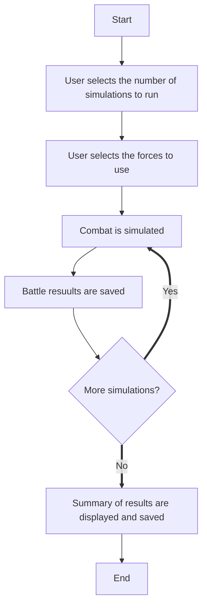

# Battletech Simulator - Activity Flow Chart

```mermaid

flowchart TB
    start[Start] 
    parameters[User selects the number of simulations to run]
    forces[User selects the forces to use]
    combat[Combat is simulated]
    battleResults[Battle resuults are saved]
    more{More simulations?}
    results[Summary of results are displayed and saved]
    END[End]

    start --> parameters
    parameters --> forces
    forces --> combat
    combat --> battleResults
    battleResults --> more
    more == Yes ==> combat
    more == No ==> results
    results --> END
```
