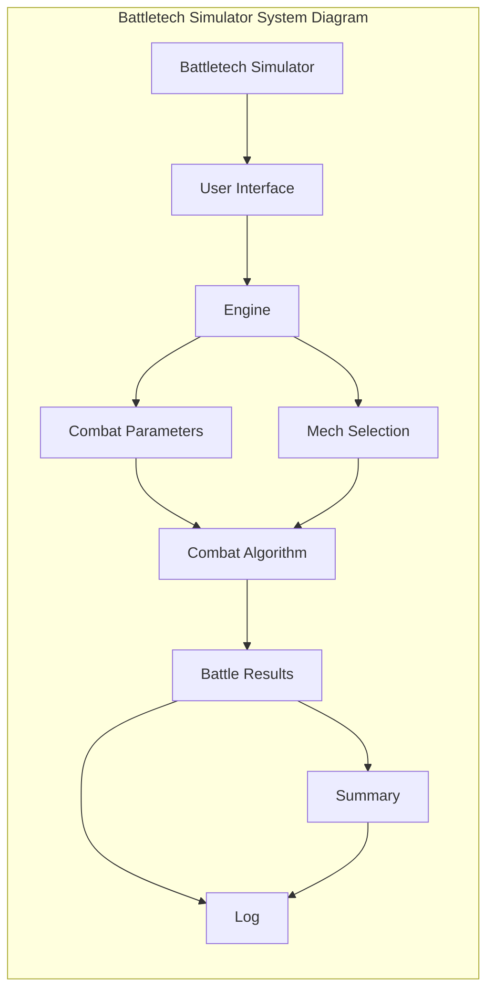

# Battletech Simulator Diagrams

```mermaid

flowchart LR        
    
    subgraph Battletech Simulator System Diagram
        top[Battletech Simulator]
        ui[User Interface]
        engine[Engine]
        combatParams[Combat Parameters]
        mechSelection[Mech Selection]
        combatAlgo[Combat Algorithm]
        battleResults[Battle Results]
        summary[Summary]
        log[Log]

        top --> ui
        ui --> engine
        engine --> combatParams
        combatParams --> combatAlgo
        engine --> mechSelection
        mechSelection --> combatAlgo
        combatAlgo --> battleResults
        battleResults --> summary
        battleResults --> log
        summary --> log
    end


```